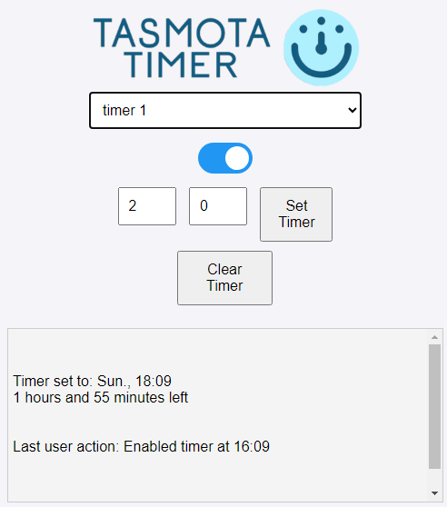

# Tasmota Timer Features

## User-Friendly Interface
- Simple and intuitive web interface for controlling timers on Tasmota-powered smart plugs.
- Capable to set and check timers on multiple Tasmota devices (selectable via pull down).
- Indication of timer: set time (hour:minute day) and indication of time left (hours:minutes).
- Semi-realtime indication of powerswitch status to the client.

## Cross-Device Access
- Accessible via mobile phones, PCs, and other internet-enabled devices.
- Responsive design to ensure optimal usability on any screen size.

## Configuration file
- Configuration file to store server settings like client password and loging status: `config.json`.
- Configuration file to store settings for Tasmota devices like friendly name, password and IP adress: `config.json`.

## Secure Authentication
- Implemented in `index.js` using hashed passwords stored in `config.json`.
- Utilizes Basic Authentication for securing routes.
- Decoupled user and device authentication for enhanced security.
- Hides IP information about Tasmota for the end-user.

## Subnet Support
- End-users client can be on different subnet as node.js server bridges them.
- Setup allows for implementing firewall rules blocking direct access to Tasmota device by client.

## Extensive Logging
- Logging capabilities for development and troubleshooting.
- Logs user actions, system events, and device interactions.
- Provides relevant error reports with indication of function.

# Screenshot of the client interface

